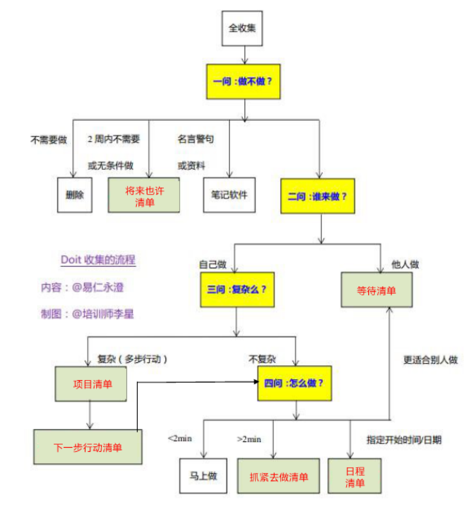

## 个人行动管理系统

#### 一、个人行动管理的道术器
* 1、道 -- 价值观
> 目的：明确价值观 -- 要事优先
* 2、术 -- 方法论
> 目的：搞定事情
> 
> 例如：收集 - 处理/组织 - 检视 - 执行 - 归档 - 回顾
* 3、器 -- 实现术的工具
> 万用手册、便利贴、Doit.im

#### 二、个人行动管理之收集
* 1、收集范围
> 全收集，收集全部信息

* 2、收集分类
> 身体、工作、素质、家庭、兴趣、社交

* 3、收集意义
> 可以盘点自己，增加对工作生活的掌控

#### 三、个人行动管理之处理

* 1、先问做不做？
> 目的：找出不做的事情
> 
> 不做：没有条件做（清单），短期内做不了（清单），不需要做(删除)
> 
> 清单：将来也许清单（Someday/Maybe）
* 2、再问谁来做？
> 目的：找出可以由他人做的事情
> 
> 他人做的事情：指派给他人，他人做更合适，授权但不放权
> 
> 清单：等待清单（Wait）
* 3、三问复杂么？
> 目的：找出复杂的任务
> 
> 复杂任务：分解成简单任务
> 
> 清单：项目清单（Project），下一步清单（Next Action）
* 4、四问怎么做？
> 来源：下一步清单、自己做的不复杂的事情
> 
> 做法：马上去做（<2min），指定时间去做（日程清单），别人去做（等待清单），抓紧去做（下一步清单）

* 5、处理完成标志
> 收件箱清空

* 6、处理得到6个清单
> 将来也许清单
> 等待清单
> 项目清单
> 下一步清单
> 日程清单
> 抓紧去做清单

* 7、处理流程图

#### 四、个人行动管理之组织

* 1、目的
> 对行动清单进行管理：情境管理，优先级管理、精力损耗管理

* 2、情境管理
> 情境定义：在一定时间内各种情况的相对的或结合的境况
> 
> 情境作用：批处理任务，节约成本
> 
> 情境设置：根据自己实际情况深圳，例如：办公室、家里、外出

* 3、优先级管理
> 目的：对行动进行排序
> 
> 按照执行顺序排序：对项目进行分解的下一步行动
> 
> 按照重要与否进行排序：对抓紧去做的行动

* 4、精力损耗管理
> 目的：平均分配精力
>  
> 设置：轻松、平均、努力

#### 五、个人行动管理之检视
* 1、什么是检视？
> 定期浏览你的各项清单和计划
* 2、检视目的
> 让自己掌控自己各个高度
* 3、什么时候检视
> 空下来的时候
* 4、检视什么
> 今日待办清单 -- 完成一个任务时检视
> 
> 将来/也许清单 -- 每天检视
> 
> 等待清单 -- 每天检视
> 
> 项目清单 -- 每天检视
> 
> 下一步清单 -- 每天检视
> 
> 周计划 -- 每天检视
> 
> 月计划 -- 每周检视
> 
> 年计划 -- 每月检视

#### 六、个人行动管理之执行
* 1、日计划确定
> 先看今日待办清单，预估消耗时间
> 
> 再看下一步清单，找到优先级最高的，并预估时间，加入今日待办清单
> 
> 对今日待办清单，重新排优先级

* 2、日计划执行
> 按开始时间执行
> 
> 按情境执行
> 
> 按优先级执行
> 
> 按精力损耗执行
> 
> 按时间损耗执行

#### 七、个人行动管理之归档
* 1、归档方式
> 结合笔记软件实现归档
>
> 按分类记录：工作、身体、素质、家庭、兴趣、社交
> 
> 每个时间段记录自己在干什么？

#### 八、个人行动管理之回顾
* 1、回顾的目的
> 让自己知道下一步如何走的更好
* 2、回顾什么？
> 行动清单
* 3、回顾周期
> 日回顾
> 
> 周回顾
> 
> 月回顾

