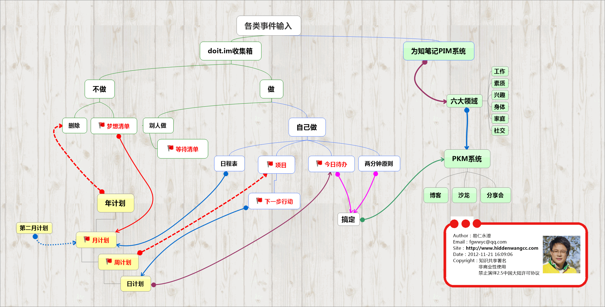

##建立个人管理系统

#### 一、什么是个人管理系统？

> 为了更高效、更方便地`实现自我提升`而建立的一种相互作用、相互促进的`价值观、决策判断、思考模式、任务流程、生活习惯`等一系列世界观、方法论形成的`有机整体`。

#### 二、为什么要建立个人管理系统？

* 1、降低成本，提高效率
* 2、提高专注，强化执行
* 3、加强学习，洞察细节
* 4、信守承诺，掌握节奏
* 5、远离焦虑，快乐生活
* 6、坚持不懈，追寻幸福

#### 三、个人管理系统是什么样的？

* 1、个人管理系统，它是一个完整的整体，里面由一个一个的小型系统构成的。
> 例如：目标管理、行动管理、知识管理、情绪管理、人脉管理、健康管理、财富管理、等等.

* 2、每一个小的系统都有自己的意义、目的、流程、原则等内容。
> 行动管理、包含：全收集、组织处理、检视、搞定、归档、回顾。

* 3、每个小系统之间都是相互关联、相互促进的，是不可分割的一个整体

#### 四、个人管理系统构建之路

##### 1、开启并持续培养心智能力
* a、什么是心智？
> 心智是人们各项思维能力的总和，用以感受、观察、理解、判断、选择、记忆、想像、假设、推理，而后根据指导其行为。

* b、心智三要素
> 学习、实践、思考

* c、心智开启的方法
> 阅读、自律、独立思考、内省

* d、心智开启的标准

		1.意识到成熟是一个过程而非一种状态，并热衷于提升自己。
		2.有能力控制好自己的猜忌与嫉妒。
		3.能做到倾听和反思别人的观点。
		4.在日常生活中既能表现出耐心，也能体现出灵活性。
		5.能够接受无法改变的事实，能从错误中吸取教训而不是发牢骚。
		6.不被恐惧所吓倒，能看到事物的积极面。
		7.有能力区分头脑冷静时的决策与情感冲动时的决定之间的不同。
		8.懂得“机会只偏爱有准备的人”这一道理。
		9.有能力控制好自己的脾气与愤怒。
		10.不自私，能考虑到他人的感受。
		11.能区分出“需要”与“想要”之间的不同。
		12.自信但不傲慢。
		13.能镇定自若地应对压力。
		14.独立自主又能对自己的行为负责。
		15.有能力克服恐惧感。
		16.能在“非此即彼”的极端思维中看到事物的其它方面。
		17.接受负面反馈，并视其为提升自我的工具。
		18.自重而又有危机意识。
		19.能够区分真爱与暂时的迷恋之间的区别。
		20.懂得“开诚布公地交流是取得进展的关键

* e、心智成长
> 源于自省，始于自律，成于自爱爱人，而这一切则伴随着三观的不断修正与完善，最后达于天人合一。
> 
> 自省是思想层面，自律是行动层面。
> 
> 爱是自律的力量源泉，而自律又是将爱转化为实际行动的过程。

##### 2、培养自己的自律能力
* a、什么是自律？
> 自我要求

* b、自律四方面
> 推迟满足感、承担责任、尊重事实、保持平衡。

* c、培养自律能力
> 做一件自己不是那么喜欢做的事情；这件事情有意义；当天一定能完成的。

* d、培养自律的四要素
> 深层次的价值观、精确的行为、特定的时间去执行、持之以恒的积极重复

##### 3、学着养成好的习惯
* a、什么是习惯？
> 长期形成的，不易改变的人们的基本的素质

* b、习惯的重要性
> 我们每天90%的行为方式是由习惯决定的；
> 
> 我们造就了习惯，习惯成就了我们。

* c、习惯的养成就是科学的自我管理
> 复杂的事情--简单化；
> 
> 简单的事情--可操作化；
> 
> 可操作的事情--度量化、数字化；
> 
> 可度量、数字化的事情--可考评化；
> 
> 可考评的事情--流程化。

* d、习惯养成步骤
> 选择习惯（明确目标、转化语言）；
> 
> 规划习惯（确定习惯清单，合并排序）；
> 
> 准备养成习惯（了解习惯养成规律、给自己暗示，循序渐进定计划）；
> 
> 将习惯公诸于众（公布计划、进度、结果）

* e、习惯养成之后
> 成为自身规范化体系的一部分

##### 4、构建一个个小型的系统
* a、每一个小的系统都包含有系统使用原则、系统操作流程、特殊情况处理等部分
> 系统使用原则：将所有可执行的工作在该系统内流转、……；
> 
> 系统操作流程：就是上图给出的流程；
> 
> 特殊情况处理：如果我没有按照这个系统操作时，导致系统失效了应该如何处置……

* b、小系统构建的最困难的地方就是在于坚持行动。而坚持，是一个习惯养成的问题！

##### 5、统筹形成个人管理系统

* 这个大的系统其实都是由一个个的小系统构建而成的

#### 五、个人管理的核心

##### 1、个人管理的核心部件
> [个人目标管理系统](PGM.md)、[个人行动管理系统](PAM.md)、[个人知识管理系统](PKM.md)

##### 2、个人管理内部关系
> 个人管理系统分为了两个部分，一个是核心部，另外一部分是扩展系统，除去核心部件的其他系统。扩展系统，其实都是挂接在个人知识管理系统上.

##### 3、个人管理系统核心部件融合

##### 4、个人管理系统核心部件的工具

* a、目标管理系统
> 万用手册、MindManager

* b、行动管理系统
> Doit.im

* c、知识管理系统
> 为知笔记、印象笔记
